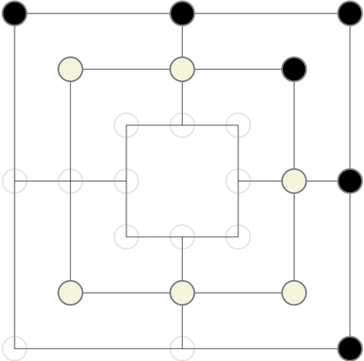

# Merels on the Blockchain

Merels is a board game, also known as "Mühle" or "Nine Man Morris".

License: MIT

The purpos of this project was to learn solidity and interact with the blockchain (via Metamask).

All moves are stored on the Blockchain.

As the costs of playing a game on the Ethereum main chain would be to high, I decided to move to the Second-Layer solution Matic and deployed it on the Mumbai Testnet.

## Feel free to join in and play a game on the testnet!
-> http://merels.maushammer.at

The project is in its ALPHA phase so there might be some bugs and it would be great if you can report them, when encountering them.

## Project structure
* blockchain -> solidity smart contract
* frontend -> the angular dapp to interact with the smart contract.

## Next on the roadmap:
* Add history data
* [frontend] Optimize loading and distributing data between the components
* Evaluate if the Winner of the Lucky Pot should be randomly selected.
* [blockchain] Add a lot of testing to the smart contract
* [frontend] Add testing to the angular project
